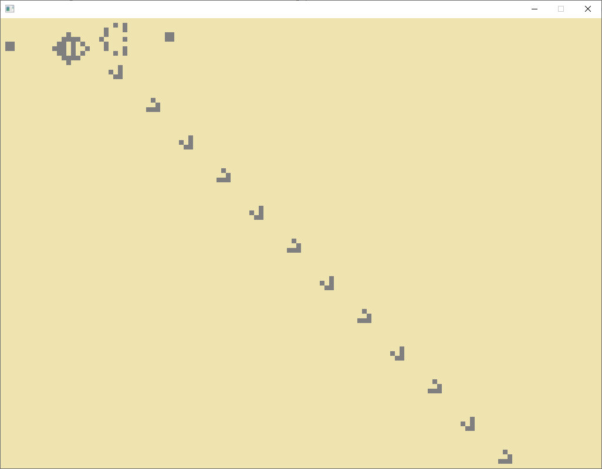

# gameoflife
Conway's Game of Life example implementation in C

If you don't know the Game of Life yet, checkout the [Wikpedia article](https://en.wikipedia.org/wiki/Conway%27s_Game_of_Life).

My example is very simple at the moment. It renders the so called "Gosper's Glider gun" by default. If you compile it with the 'RANDOM\_INIT' option it starts with a random init pattern.

The file 'gol.c' can be compiled with gcc and Visual Studio. It uses the SDL 2 library for the output. You can get the headers and libs from the [SDL 2 homepage](https://www.libsdl.org/download-2.0.php). On linux it might be a good idea to use the official download repo from your distro.

Then, with gcc it' as simple as

    $ gcc gol.c -o game_of_life -I/usr/include/SDL2/ -lSDL2

With Visual Studio you have to add the include folder and 'SDL2.lib' from the SDL2-devel-2.0.12-VC package to your Windows Application project. After the build is done put the 'SDL2.dll' next to the generated EXE-file and you are ready to go!

